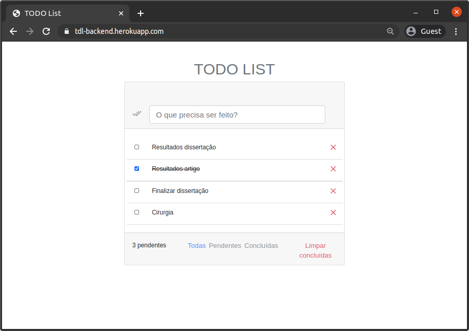

# TODO List - Backend + JSF

<p align="center"></p>

O serviço está diposnível no endereço https://tdl-backend.herokuapp.com para acesso ao front em JSF + Primefaces + Bootstrap.
Os serviços da API que servem o App Flutter e o serviço em React estão em https://tdl-backend.herokuapp.com/tasks/.


## Features desenvolvidas

- [x] A. JavaServer Faces (JSF)
- [x] B. persistência em banco de dados `PostgreSQL`
- [x] C. Hibernate e JPA
- [x] D. Spring Boot 2.5
- [x] E. Spring MVC
- [x] F. Bootstrap 4
- [x] G. Primefaces 8.0
- [x] H. Testes unitários com Junit
- [x] I. SPA com react
- [x] J. Publicação no Heroku
- [x] K. Aplicativo Flutter

### Acenssando Aplicação no Heroku

Endereço: https://tdl-backend.herokuapp.com/

> Observação: O carregamento inicial é mais lento

### Rodando em ambiente local


#### Dependências:

* [Git](https://git-scm.com/downloads) - Versionamento do código
* [Maven](https://maven.apache.org/install.html) - Construção e gerenciamento de dependências
* [Docker](https://docs.docker.com/engine/install/ubuntu/) - Cria container para ambiente utilizado
* [Docker Compose](https://docs.docker.com/compose/install/) - Facilita a criação e gerencia a execução de containers no Docker


#### Baixando e acessando projeto:

Clone o projeto
```bash
git clone https://github.com/Barbalho12/todolist-backend.git
```

Acesse o diretório do projeto
```bash
cd todolist-backend
```

**IMPORTANTE:** Altere a branch do proejto para `dev`. Será trocado as variáveis de ambiente para uso local: 
```bash
git checkout dev
```

#### Configurando o ambiente:

Acesse a página `deploy`
```bash
cd deploy/
```

Crie o container docker para o banco de dados executando o docker-compose.yaml:

```bash
docker-compose up -d # ou "docker-compose start" se já executou o "up" em algum momento anterior
```
Nesse passo será iniciado o banco de dados PostgreSQL, rodando na porta `5432`, e acessível em `localhost`.
O banco terá username `postgres`, senha `1234` e a base de dados `todolistdb` usada pelo proejto já criada.

#### Executando 

Acesse novamente a raiz do projeto e execute:

```bash
mvn spring-boot:run
```

### Outros Projetos

- [React](https://github.com/Barbalho12/todolist-spa)
- [Flutter](https://github.com/Barbalho12/todolist-flutter)